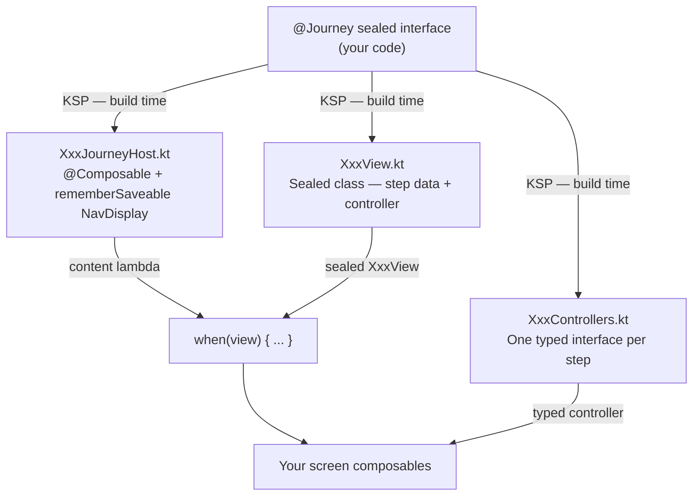

# JourneyKMP

[](https://central.sonatype.com/artifact/dev.jianastrero/journey-kmp)
[](https://kotlinlang.org)
[](LICENSE)


A type-safe, annotation-driven navigation library for Kotlin Multiplatform (Android & iOS), built on top of [Navigation3](https://developer.android.com/jetpack/compose/navigation3).

You define a journey as a sealed interface. KSP reads it at build time and generates a typed controller per step, a sealed view class, and a ready-to-use Compose host. Screens can only navigate to the exits you declared — nothing more.

- **Compile-time safety** — exhaustive `when` on the view type means the compiler flags any unhandled step.
- **Typed controllers** — each screen only sees the exits it declared; no accidental cross-step navigation.
- **Zero boilerplate back stack** — `NavDisplay` + `rememberSaveable` wiring is generated for you and survives configuration changes.
- **Side-effects as data** — `@Piggyback` attaches analytics, logging, or cache calls to a step without touching screen code.

---

## Supported Platforms

| Platform | Supported |
|---|:---:|
| Android | ✅ |
| iOS (arm64, simulator arm64) | ✅ |
| Desktop (JVM) | ❌ |
| Wasm / JS | ❌ |

---

## How it works



Each box you write is one sealed interface. Everything else — the controllers, the view type, the host composable, the back stack — is generated at build time and is never something you maintain.

---

## Installation

Add the KSP plugin and JourneyKMP to your multiplatform module's `build.gradle.kts`:

```kotlin
plugins {
    id("com.google.devtools.ksp") version "2.3.9"
}

kotlin {
    sourceSets {
        commonMain.dependencies {
            implementation("dev.jianastrero:journey-kmp:0.1.0")
        }
    }
}

dependencies {
    // Run the KSP processor against the common source set
    add("kspCommonMainMetadata", "dev.jianastrero:journey-kmp-ksp:0.1.0")
}
```

> **Note:** `journey-kmp-annotations` is a transitive dependency of `journey-kmp` — no need to add it separately.

---

## Usage

### 1. Define a journey

Create a sealed interface in `commonMain`, extend `JourneyStep`, and annotate it with `@Journey`. Each subclass is a step; `@Exit` declares where that step can navigate.

The example below is taken from the Bazaar sample app's sign-in flow. It shows two exits from a single step (password and SSO), data class steps that carry state forward through the journey, and piggybacks that fire analytics and session events automatically:

```kotlin
@Journey
sealed interface SignIn : JourneyStep {

    // ON_ENTER: fires immediately — registers a screen view even if the user bounces.
    // ON_EXIT: fires on departure regardless of direction — measures the credentials
    //          screen bounce rate from a single event stream.
    @Step
    @Piggyback("analytics:screen_view", on = ON_ENTER)
    @Piggyback("analytics:credentials_screen_exit", on = ON_EXIT)
    @Exit("toPassword", EnterPassword::class)
    @Exit("toSSO", SSOLoading::class)
    data object EnterCredentials : SignIn

    // ON_EXIT for both: auth method and audit log are confirmed when the user *leaves*,
    // whether they succeed or press back.
    @Step
    @Piggyback("analytics:auth_method_password", on = ON_EXIT)
    @Piggyback("log:password_auth_attempt", on = ON_EXIT)
    @Exit("toDone", Done::class)
    data class EnterPassword(val username: String) : SignIn

    // SSO provider is known on arrival — ON_ENTER is the right trigger here.
    @Step
    @Piggyback("analytics:auth_method_sso", on = ON_ENTER)
    @Exit("toDone", Done::class)
    data class SSOLoading(val provider: String) : SignIn

    // Terminal step — KSP generates finish() on SignInDoneController.
    // session:start fires on arrival; cache prefetch fires on exit (just before navigating away).
    @Step
    @Piggyback("analytics:signin_completed", on = ON_ENTER)
    @Piggyback("session:start", on = ON_ENTER)
    @Piggyback("cache:prefetch_user_data", on = ON_EXIT)
    data object Done : SignIn
}
```

**Annotation reference**

| Annotation | Purpose |
|---|---|
| `@Journey` | Marks the sealed interface; triggers KSP code generation |
| `@Step` | Marks a sealed subclass as a navigation step |
| `@Exit("name", To::class)` | Generates `fun name(...)` on the controller; parameters come from `To`'s primary constructor |
| `@Piggyback("id", on = ...)` | Fires a named side-effect on `ON_ENTER` (default) or `ON_EXIT` |

**Rules enforced at build time**
- The interface must extend `JourneyStep`
- The first subclass must be a `data object` (it is the initial step and requires no constructor arguments)
- A step with no `@Exit` is terminal — KSP generates `fun finish()` on its controller

---

### 2. What gets generated

For the `SignIn` journey above, KSP produces three files in the same package:

| Generated file | Contents |
|---|---|
| `SignInControllers.kt` | One interface per step — `SignInEnterCredentialsController`, `SignInEnterPasswordController`, etc. Each exposes only the exits declared for that step plus `back()` from `StepController`. |
| `SignInView.kt` | `sealed class SignInView` with one inner class per step. Data class steps (e.g. `EnterPassword`) include a `step` property carrying the accumulated data; all steps include their `controller`. |
| `SignInJourneyHost.kt` | `@Composable fun SignInJourneyHost(onFinish, content)` wired to Nav3's `NavDisplay` with a `rememberSaveable` back stack. |

<details>
<summary>Generated: <code>SignInJourneyHost.kt</code></summary>

```kotlin
package dev.jianastrero.journey.example.journeys

import androidx.compose.runtime.Composable
import androidx.compose.runtime.DisposableEffect
import androidx.compose.runtime.LaunchedEffect
import androidx.compose.runtime.mutableStateListOf
import androidx.compose.runtime.remember
import androidx.compose.runtime.rememberCoroutineScope
import androidx.compose.runtime.saveable.listSaver
import androidx.compose.runtime.saveable.rememberSaveable
import androidx.navigation3.runtime.NavEntry
import androidx.navigation3.ui.NavDisplay
import dev.jianastrero.journey.JourneyStep
import dev.jianastrero.journey.LocalPiggybackRegistry
import dev.jianastrero.journey.navigateTo
import kotlin.String
import kotlin.Unit
import kotlinx.coroutines.launch

@Composable
public fun SignInJourneyHost(onFinish: () -> Unit = {}, content: @Composable (SignInView) -> Unit) {
  val backStack = rememberSaveable(saver = listSaver(
    save = { list -> list.map { step ->
      when (step) {
        is SignIn.EnterCredentials -> "EnterCredentials"
        is SignIn.EnterPassword -> "EnterPassword|${step.username}"
        is SignIn.SSOLoading -> "SSOLoading|${step.provider}"
        is SignIn.Done -> "Done"
        else -> ""
      }
    }},
    restore = { saved ->
      mutableStateListOf(*saved.mapNotNull { encoded ->
        val parts = encoded.split("|")
        when (parts.getOrNull(0)) {
          "EnterCredentials" -> SignIn.EnterCredentials
          "EnterPassword" -> SignIn.EnterPassword(parts[1])
          "SSOLoading" -> SignIn.SSOLoading(parts[1])
          "Done" -> SignIn.Done
          else -> null
        }
      }.toTypedArray())
    }
  )) { mutableStateListOf<JourneyStep>(SignIn.EnterCredentials) }
  val piggybackRegistry = LocalPiggybackRegistry.current
  val scope = rememberCoroutineScope()

  NavDisplay(backStack = backStack, onBack = { backStack.removeLastOrNull() }) { step ->
    when (step) {
      is SignIn.EnterCredentials -> {
        NavEntry(step) {
          LaunchedEffect(step) {
            piggybackRegistry?.fire("analytics:screen_view", stepId = "EnterCredentials", journeyId = "SignIn")
          }
          DisposableEffect(step) {
            onDispose {
              scope.launch { piggybackRegistry?.fire("analytics:credentials_screen_exit", stepId = "EnterCredentials", journeyId = "SignIn") }
            }
          }
          val controller = remember(backStack) {
            object : SignInEnterCredentialsController {
              override fun toPassword(username: String) {
                navigateTo(backStack, SignIn.EnterPassword(username))
              }
              override fun toSSO(provider: String) {
                navigateTo(backStack, SignIn.SSOLoading(provider))
              }
              override fun back() {
                backStack.removeLastOrNull()
              }
            }
          }
          content(SignInView.EnterCredentials(controller))
        }
      }
      is SignIn.EnterPassword -> {
        NavEntry(step) {
          DisposableEffect(step) {
            onDispose {
              scope.launch { piggybackRegistry?.fire("analytics:auth_method_password", stepId = "EnterPassword", journeyId = "SignIn") }
              scope.launch { piggybackRegistry?.fire("log:password_auth_attempt", stepId = "EnterPassword", journeyId = "SignIn") }
            }
          }
          val controller = remember(backStack) {
            object : SignInEnterPasswordController {
              override fun toDone() {
                navigateTo(backStack, SignIn.Done)
              }
              override fun back() {
                backStack.removeLastOrNull()
              }
            }
          }
          content(SignInView.EnterPassword(step, controller))
        }
      }
      is SignIn.SSOLoading -> {
        NavEntry(step) {
          LaunchedEffect(step) {
            piggybackRegistry?.fire("analytics:auth_method_sso", stepId = "SSOLoading", journeyId = "SignIn")
          }
          val controller = remember(backStack) {
            object : SignInSSOLoadingController {
              override fun toDone() {
                navigateTo(backStack, SignIn.Done)
              }
              override fun back() {
                backStack.removeLastOrNull()
              }
            }
          }
          content(SignInView.SSOLoading(step, controller))
        }
      }
      is SignIn.Done -> {
        NavEntry(step) {
          LaunchedEffect(step) {
            piggybackRegistry?.fire("analytics:signin_completed", stepId = "Done", journeyId = "SignIn")
            piggybackRegistry?.fire("session:start", stepId = "Done", journeyId = "SignIn")
          }
          DisposableEffect(step) {
            onDispose {
              scope.launch { piggybackRegistry?.fire("cache:prefetch_user_data", stepId = "Done", journeyId = "SignIn") }
            }
          }
          val controller = remember(backStack) {
            object : SignInDoneController {
              override fun back() {
                backStack.removeLastOrNull()
              }
              override fun finish() {
                onFinish()
              }
            }
          }
          content(SignInView.Done(controller))
        }
      }
      else -> NavEntry(step) {}
    }
  }
}
```

</details>

---

### 3. Drop in the host

Place `SignInJourneyHost` where the flow starts. The `content` lambda receives a sealed `SignInView` — use a `when` block to render the right screen for each step:

```kotlin
@Composable
fun AuthScreen(onSignedIn: () -> Unit) {
    SignInJourneyHost(onFinish = onSignedIn) { view ->
        when (view) {
            is SignInView.EnterCredentials ->
                EnterCredentialsScreen(
                    controller = view.controller,
                    onSwitchToSignUp = { /* navigate to sign-up */ },
                )
            is SignInView.EnterPassword ->
                EnterPasswordScreen(view.step, view.controller)

            is SignInView.SSOLoading ->
                SSOLoadingScreen(view.step, view.controller)

            is SignInView.Done ->
                SignInDoneScreen(view.controller)
        }
    }
}
```

The compiler enforces exhaustiveness on `view` — no `else` branch needed and no step can be forgotten. Back navigation (system gesture or button) is handled automatically.

---

### 4. Implement your screens

Each screen receives only the typed controller for its step. The only navigation methods available are the exits you declared — the type system makes it impossible to call a different step's transitions by mistake:

```kotlin
// Only toPassword() and toSSO() are available — there is no way to jump to Done directly.
@Composable
fun EnterCredentialsScreen(
    controller: SignInEnterCredentialsController,
    onSwitchToSignUp: () -> Unit,
) {
    var username by remember { mutableStateOf("") }
    // ...
    Button(onClick = { controller.toPassword(username.trim()) }) { Text("Continue") }
    Button(onClick = { controller.toSSO("Google") }) { Text("Continue with Google") }
}

// username was forwarded from EnterCredentials — no extra global state needed.
@Composable
fun EnterPasswordScreen(
    step: SignIn.EnterPassword,
    controller: SignInEnterPasswordController,
) {
    // ...
    Button(onClick = { controller.toDone() }) { Text("Sign in") }
    Button(onClick = { controller.back() }) { Text("Back") }
}

// Terminal step: finish() is the only navigation available.
@Composable
fun SignInDoneScreen(controller: SignInDoneController) {
    // ...
    Button(onClick = { controller.finish() }) { Text("Continue to app") }
}
```

---

### 5. Piggybacks (optional)

A piggyback is a named side-effect — analytics, logging, cache invalidation — that fires automatically when a step is entered or exited.

**Trigger reference**

| Trigger | When it fires | Compose mechanism used |
|---|---|---|
| `ON_ENTER` *(default)* | The step becomes the active screen | `LaunchedEffect(step)` |
| `ON_EXIT` | The step is removed from the screen | `DisposableEffect.onDispose` |

Register handlers by providing a `PiggybackRegistry` through the composition:

```kotlin
@Composable
fun App() {
    val registry = remember {
        PiggybackRegistry().apply {
            register("analytics:screen_view") { stepId, journeyId ->
                analytics.track("screen_view", mapOf("step" to stepId, "journey" to journeyId))
            }
            register("session:start") { _, _ ->
                sessionManager.start()
            }
            register("cache:prefetch_user_data") { _, _ ->
                cache.prefetchUserData()
            }
        }
    }

    CompositionLocalProvider(LocalPiggybackRegistry provides registry) {
        SignInJourneyHost(onFinish = { /* ... */ }) { view ->
            // ...
        }
    }
}
```

If a step fires a piggyback and no handler is registered for that id, JourneyKMP prints a warning to help catch mismatches during development:

```
JourneyKMP Warning: no handler registered for piggyback id='analytics:screen_view'
(step='EnterCredentials', journey='SignIn'). Call register("analytics:screen_view") { … }
before this step is entered.
```

---

## How navigation works

### Back stack

Navigation uses **pop-or-push** logic (see `navigateTo`):

- If the target step's class is **already in the stack**, the stack pops down to that entry — no duplicates.
- If the target step's class is **not in the stack**, it is pushed.

This means `controller.back()` and an explicit `controller.toEnterCredentials()` exit both arrive at `EnterCredentials` correctly, regardless of how deep the stack is.

### Configuration change survival

The generated back stack uses `rememberSaveable` with a custom `listSaver`. Each step is encoded to a pipe-delimited string at save time and reconstructed from it on restore — no `@Serializable` annotation needed on your step classes. The journey resumes exactly where the user left off after a screen rotation or process death.

---

## Example App

The `example/` directory contains **Bazaar**, a minimal ecommerce app for Android and iOS that exercises every feature of the library.

| Journey | Steps | Demonstrates |
|---|---|---|
| `SignIn` | EnterCredentials → EnterPassword / SSOLoading → Done | Two exits from one step, ON_EXIT piggybacks |
| `SignUp` | EnterUsername → EnterEmail → EnterPassword / SSOLoading → Done | Multi-step data forwarding |
| `CreateListing` | EnterTitle → EnterDescription → EnterPrice → Review → Published | Five-step linear flow, review before commit |
| `EditListing` | EnterTitle → EnterDescription → EnterPrice → Done | Data class steps pre-filled from existing state |
| `DeleteListing` | Confirm → Done | Two-step confirmation with cancel on first step |
| `Checkout` | ReviewCart → EnterAddress → SelectPayment → EnterCardDetails → Processing → Done | Longest flow; `Processing` fires an API call via piggyback |
| `Logout` | Confirm → Done | Minimal two-step flow |

The app-level routing (Auth ↔ Main, tab navigation, journey overlays) is also handled with Nav3 `NavDisplay`, showing how JourneyKMP integrates with ordinary non-journey navigation.

To run it, open the repo in Android Studio and launch the `:example:androidApp` run configuration.

---

## Changelog

See [CHANGELOG.md](CHANGELOG.md) for a full version history.

---

## Contributing

Contributions are welcome. Here's how to get set up:

```bash
git clone https://github.com/jianastrero/JourneyKMP.git
cd JourneyKMP

# Build everything (library + KSP processor + example app)
./gradlew build

# Run the Android example app
# Open in Android Studio and run :example:androidApp
```

**Key modules**

| Module | What it is |
|---|---|
| `journey-kmp-annotations` | The public `@Journey`, `@Step`, `@Exit`, `@Piggyback` annotations |
| `journey-kmp-ksp` | The KSP processor that reads annotations and emits Kotlin source |
| `journey-kmp` | The runtime library (`JourneyStep`, `PiggybackRegistry`, `navigateTo`, etc.) |
| `example/` | The Bazaar sample app |

**Tips**
- Changes to `journey-kmp-ksp` require a clean build (or `./gradlew :example:shared:kspCommonMainKotlinMetadata`) to see the updated generated files under `example/shared/build/generated/`.
- The project follows standard Kotlin style — no redundant `public` modifiers, 4-space indentation.
- Please open an issue before submitting a large PR so the approach can be agreed on first.

---

## License

JourneyKMP is released under the [MIT License](LICENSE).
